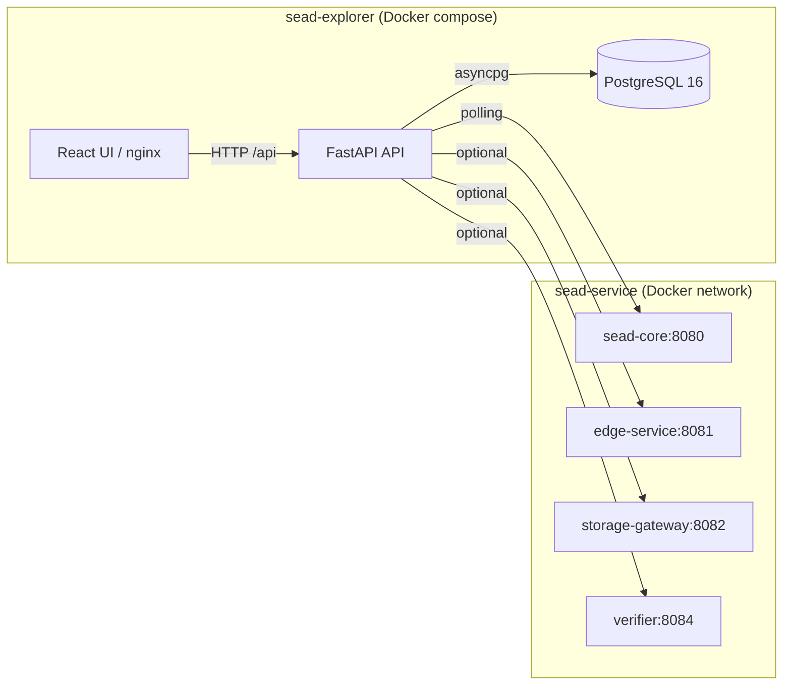

# SEAD Explorer

**Read-only operational dashboard for SEAD nodes.** Provides human-comprehensible
visibility into a SEAD node's local perspective. It is not a consensus participant,
authority, registry, or protocol component.

## Architecture



## Deploy

### Prerequisites

- Docker + Docker Compose plugin
- A running SEAD stack (see [stardome-sead](https://github.com/Stardome-technology/stardome-sead))

### Production deploy

```bash
# Ensure sead-network exists
docker network create sead-network 2>/dev/null || true

# Create .env with your configuration
# See reference below for all variables
docker compose -f docker-compose.remote.yml up -d

# Verify
curl http://localhost:8086/health
curl http://localhost:3000/
```

### Configuration

| Variable | Required | Default | Description |
|----------|----------|---------|-------------|
| `SEAD_CORE_URL` | Yes | — | sead-core HTTP endpoint |
| `DATABASE_URL` | Yes | — | PostgreSQL connection string |
| `OBSERVER_ORG_ID` | Yes | — | Observer organization identity |
| `OBSERVER_NODE_ID` | Yes | — | Observer node identity |
| `EDGE_SERVICE_URL` | No | — | edge-service HTTP endpoint |
| `STORAGE_GATEWAY_URL` | No | — | storage-gateway HTTP endpoint |
| `VERIFIER_URL` | No | — | verifier-service HTTP endpoint |
| `IPFS_API_URL` | No | — | IPFS node API endpoint |
| `INGESTION_INTERVAL_SECONDS` | No | 5 | Polling interval |
| `LOG_LEVEL` | No | INFO | Logging level |

## API Endpoints

| Method | Path | Description |
|--------|------|-------------|
| GET | `/health` | Health check |
| GET | `/api/v1/peers` | List known peers |
| GET | `/api/v1/organizations` | List observed organizations |
| GET | `/api/v1/frontier` | Frontier summary counts |
| GET | `/api/v1/events` | Event list (paginated) |
| GET | `/api/v1/events/{event_id}` | Event detail |
| GET | `/api/v1/ipfs/status` | IPFS status |
| GET | `/metrics` | Prometheus metrics |
