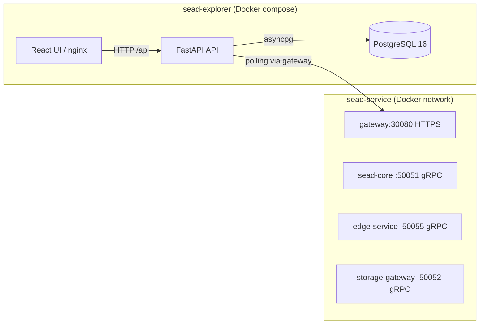

# SEAD Explorer

**Read-only operational dashboard for SEAD nodes.** Provides human-comprehensible
visibility into a SEAD node's local perspective. It is not a consensus participant,
authority, registry, or protocol component.

## Architecture


```mermaid
graph LR
    subgraph "sead-service (Docker network)"
        GW[gateway:30080 HTTPS]
        SC[sead-core :50051 gRPC]
        ES[edge-service :50055 gRPC]
        SG[storage-gateway :50052 gRPC]
    end

    subgraph "sead-explorer (Docker compose)"
        DB[(PostgreSQL 16)]
        API[FastAPI API]
        UI[React UI / nginx]
    end

    API -->|polling via gateway| GW
    API -->|asyncpg| DB
    UI -->|HTTP /api| API
```

## Deploy

### Prerequisites

- Docker + Docker Compose plugin
- A running SEAD stack (see [stardome-sead](https://github.com/Stardome-technology/stardome-sead))

### Production deploy

```bash
# Ensure sead-network exists (only needed if running standalone without the
# SEAD stack; the SEAD stack auto-creates this network at startup)
docker network create sead-network 2>/dev/null || true

# Create .env with your configuration
# See reference below for all variables
docker compose -f docker-compose.remote.yml pull
docker compose -f docker-compose.remote.yml up -d

# Verify — use 127.0.0.1, not localhost (IPv6 resolution issues)
curl http://127.0.0.1:8086/health
curl http://127.0.0.1:3000/

## Public ports to open

For an integrator deploying the explorer, these ports must be reachable from
browsers / monitoring:

- **`8086/tcp`** — FastAPI backend (`/health`, `/api/v1/*`, `/metrics`)
- **`3000/tcp`** — React UI (served via nginx)

These are the only public ports. The explorer reaches sead-core, edge-service,
storage-gateway, and verifier over the Docker network internally; those service
ports should **not** be exposed publicly. If the UI and API are only used
locally, both can stay closed to the internet.
```

### Configuration

| Variable | Required | Default | Description |
|----------|----------|---------|-------------|
| `SEAD_CORE_URL` | Yes | — | gateway HTTPS endpoint (all C++ services reached via gateway) |
| `DATABASE_URL` | Yes | — | PostgreSQL connection string |
| `OBSERVER_ORG_ID` | Yes | — | Observer organization identity |
| `OBSERVER_NODE_ID` | Yes | — | Observer node identity |
| `EDGE_SERVICE_URL` | No | — | edge-service endpoint (via gateway) |
| `STORAGE_GATEWAY_URL` | No | — | storage-gateway endpoint (via gateway) |
| `VERIFIER_URL` | No | — | verifier/auth endpoint (collapsed into gateway) |
| `SEAD_AUTH_SECRET` | No | — | Shared secret for gateway requests. The gateway requires a Bearer token on all endpoints except `/health`; set this to the gateway's `SEAD_AUTH_SECRET` so the frontier-walk ingestion is accepted. If empty, no Authorization header is sent (for gateways with auth disabled) |
| `IPFS_API_URL` | No | `https://ipfs.stardome.cloud` | IPFS node API endpoint |
| `INGESTION_INTERVAL_SECONDS` | No | 5 | Polling interval |
| `LOG_LEVEL` | No | INFO | Logging level |

#### Note about the SEAD Service URLs
After the Go-gateway migration, the C++ services are **gRPC-only** and publish no HTTP
ports. The explorer reaches everything through the **gateway** (the single HTTPS
surface on port `30080`), so all `*_URL` vars point at `https://...:30080`.

If sead-explorer is running in a docker-compose environment (on `sead-network`), use the gateway service name.
The gateway terminates TLS even on the internal network, so use `https://` and trust the CA via `SEAD_CA_CERT`:
```txt
SEAD_CORE_URL=https://gateway:30080
EDGE_SERVICE_URL=https://gateway:30080
STORAGE_GATEWAY_URL=https://gateway:30080
VERIFIER_URL=https://gateway:30080
```
If sead-explorer is running outside of docker-compose, on the host machine, use the following URLs:
```txt
SEAD_CORE_URL=https://localhost:30080
EDGE_SERVICE_URL=https://localhost:30080
STORAGE_GATEWAY_URL=https://localhost:30080
VERIFIER_URL=https://localhost:30080
```
Else if sead-explorer is running outside of docker-compose, on a remote machine, use the remote IP:
```txt
SEAD_CORE_URL=https://<IP>:30080
EDGE_SERVICE_URL=https://<IP>:30080
STORAGE_GATEWAY_URL=https://<IP>:30080
VERIFIER_URL=https://<IP>:30080
```
> When using `https://` against a self-signed/private-CA gateway, set `SEAD_CA_CERT`
> (see below) so the FastAPI client trusts the gateway's cert.

#### Trusting the gateway's TLS cert (closed deployments only)

If the explorer calls a SEAD stack over `https://` (the gateway terminates TLS at
`:30080`), it must trust the gateway's certificate. For a **private/self-signed CA**
backend (see the gateway/setup docs), mount the CA cert so the FastAPI client verifies
the gateway. This is only appropriate for **closed, isolated deployments**  where every node is under your control.

- Distribute **only `ca.crt`** as the trust anchor. Do **not** distribute `ca.srl`
  (CA working state, not a trust artifact) or any private key material.
- **Not advised for public production:** a publicly-reachable gateway should use a
  public cert (e.g. Let's Encrypt), trusted through the standard PKI with no manual
  CA distribution.

#### How the explorer trusts the CA

The `sead-explorer-api` compose service already mounts `./certs` as
`/etc/explorer/certs` (read-only) and defaults `SEAD_CA_CERT` to
`/etc/explorer/certs/ca.crt`. To make the API trust a private/self-signed CA,
just drop `ca.crt` into `./certs` (from the local/remote secure ca box) the start/restart the API:

```bash
docker compose -f docker-compose.remote.yml up -d
```

With `SEAD_CORE_URL=https://<IP>:30080` (and the other `*_URL` vars pointing at
`https://` too) in `.env`, the FastAPI client uses `CABundle` from
`SEAD_CA_CERT` and trusts the gateway without `-k`/insecure flags.

> `certs/` is gitignored in this repo, so the CA bundle will not be committed.

## API Endpoints

| Method | Path | Description |
|--------|------|-------------|
| GET | `/health` | Health check |
| GET | `/api/v1/peers` | List known peers |
| GET | `/api/v1/organizations` | List observed organizations |
| GET | `/api/v1/frontier` | Frontier summary counts |
| GET | `/api/v1/events` | Event list (paginated) |
| GET | `/api/v1/events/{event_id}` | Event detail |
| GET | `/api/v1/ipfs/status` | IPFS status |
| GET | `/metrics` | Prometheus metrics |
